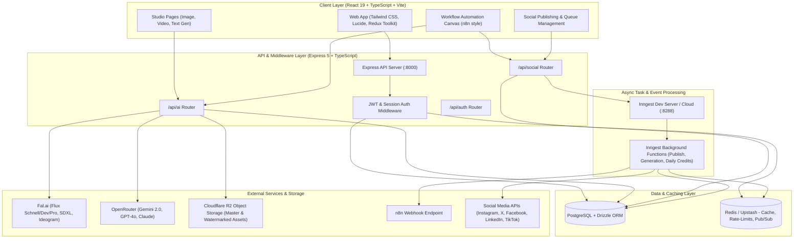
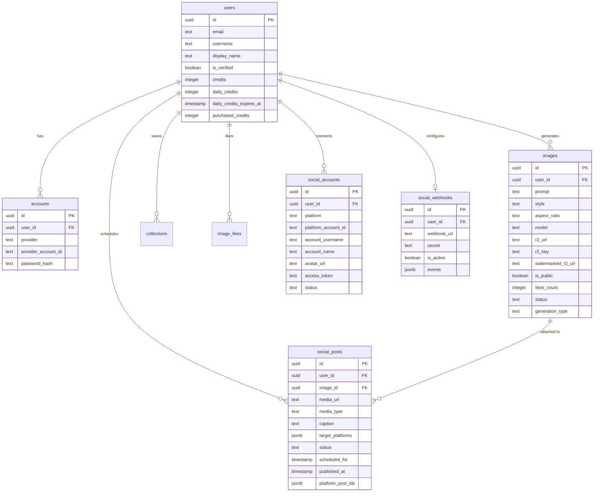
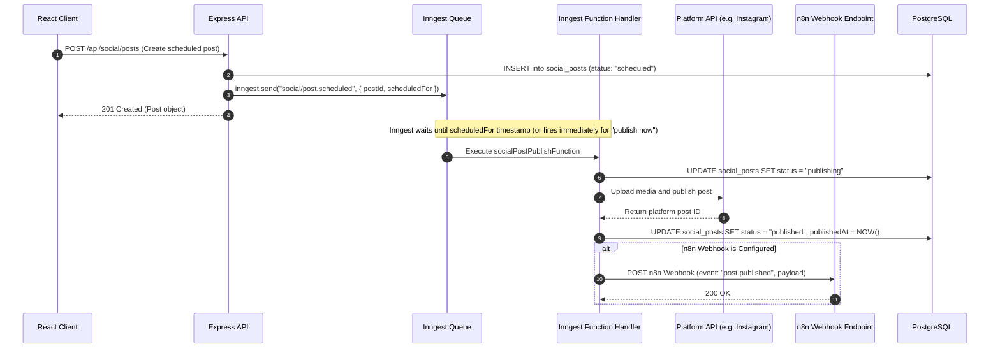

# System Architecture

Nova AI is a full-stack PERN application (PostgreSQL, Express, React, Node.js) with TypeScript, Redis, Inngest, Cloudflare R2, and external AI providers (Fal.ai and OpenRouter).

---

## 1. High-Level System Architecture



---

## 2. Repository Layout

```text
nova-ai/
├── client/                     # React 19 + TypeScript + Vite application
│   ├── src/
│   │   ├── components/
│   │   │   ├── workflow/       # Visual workflow canvas, compact cards, drawer, engine
│   │   │   ├── dashboard/      # Studio, gallery, creation modals, sidebar
│   │   │   └── social/         # Publishing calendar, scheduler, queue
│   │   ├── pages/              # Route views (WorkflowsPage, ImageGenStudioPage, etc.)
│   │   ├── store/              # Redux Toolkit & RTK Query slices (authSlice, socialSlice)
│   │   └── schema/             # Client-side Zod validation schemas
├── server/                     # Node.js Express 5 + TypeScript backend
│   ├── src/
│   │   ├── controllers/        # Route controllers (ai, auth, social, instagram)
│   │   ├── db/                 # Drizzle ORM schema and PostgreSQL pool connection
│   │   ├── inngest/            # Event-driven jobs, background publisher, and crons
│   │   ├── middlewares/        # Authentication and authorization guards
│   │   ├── routes/             # Express route definitions
│   │   ├── services/           # Fal AI, OpenRouter, R2, email, and social services
│   │   └── utils/              # Redis client, credits calculator, watermark storage
├── docs/                       # Project engineering & architecture documentation
└── AGENTS.md                   # Core development rules and repository guidelines
```

---

## 3. Database Schema (PostgreSQL + Drizzle ORM)



---

## 4. Asynchronous Task Processing with Inngest

Inngest decouples high-latency AI generation, social publishing, and cron credit renewals from HTTP request cycles:



---

## 5. Caching, Rate Limiting & Storage

* **Redis**:
  * Used for token rate limiting, verification code caching with TTL, session deduplication, and pub/sub broadcast notifications.
* **Cloudflare R2**:
  * Original high-resolution master assets and watermarked community copies are stored in Cloudflare R2 object storage.
  * Assets are served via presigned URLs, avoiding unauthorized direct bucket access.
* **Pagination Standard**:
  * In alignment with project rules, all list endpoints enforce pagination (default: 10 items per page).
