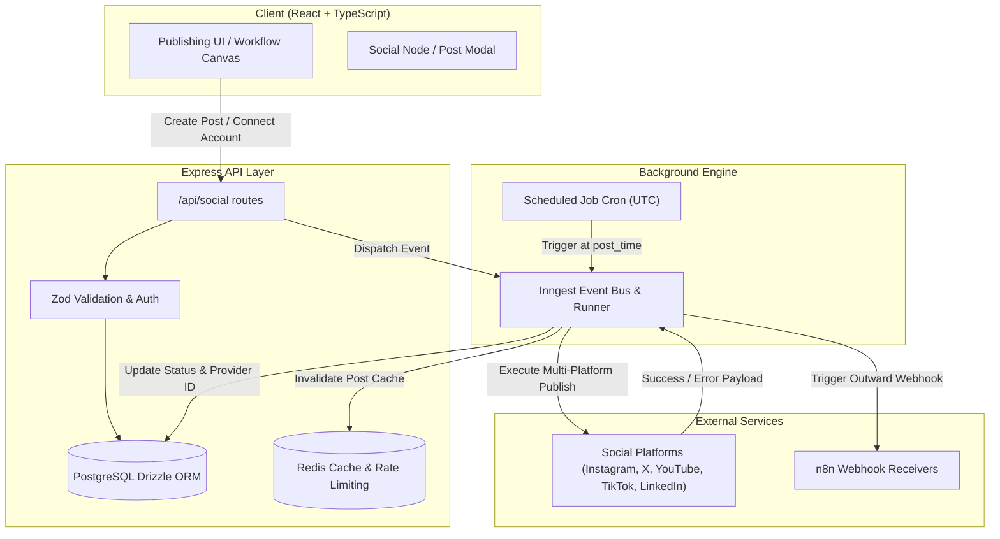
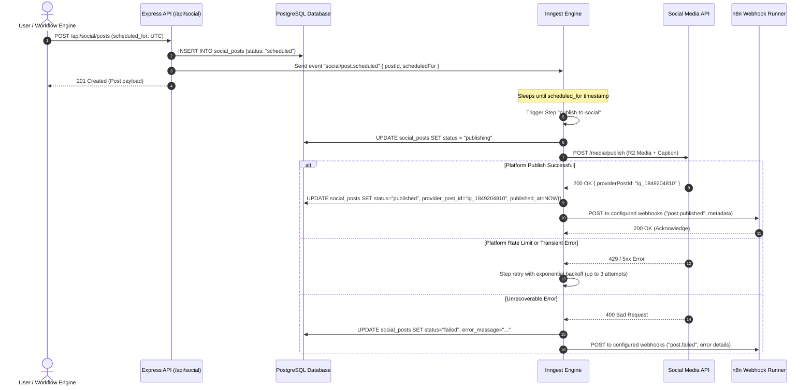
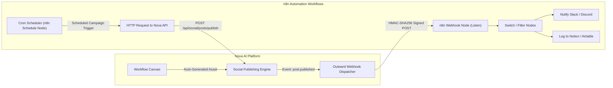

# Social Publishing & n8n Automation Engine

Nova AI includes a multi-channel social publishing engine coupled with background task orchestration via Inngest and outward webhook dispatching for n8n workflow integration.

---

## 1. System Architecture

The social publishing subsystem operates on a decoupled, asynchronous PERN architecture:



---

## 2. Database Schema (Drizzle ORM)

All social publishing entities are modeled in PostgreSQL using Drizzle ORM (`server/src/db/schema.ts`):

### 2.1 `social_accounts` Table
Tracks user-connected social media accounts across platforms.

| Column | Type | Description |
| --- | --- | --- |
| `id` | `uuid` (PK) | Unique account identifier (`gen_random_uuid()`) |
| `user_id` | `uuid` (FK) | References `users.id` (cascade delete) |
| `platform` | `varchar(32)` | Platform identifier (`instagram`, `twitter`, `youtube`, `tiktok`, `linkedin`) |
| `account_name` | `varchar(128)` | Display username / handle (e.g. `@novacreator`) |
| `account_id` | `varchar(128)` | Platform-specific unique user/page ID |
| `avatar_url` | `text` | Profile avatar URL |
| `access_token` | `text` | Encrypted OAuth access token |
| `refresh_token` | `text` | Encrypted OAuth refresh token |
| `token_expires_at`| `timestamp` | Token expiration timestamp (UTC) |
| `is_active` | `boolean` | Connection health status (default `true`) |
| `metadata` | `jsonb` | Platform metadata (page IDs, permissions, verified badge) |
| `created_at` | `timestamp` | Creation timestamp |
| `updated_at` | `timestamp` | Last update timestamp |

### 2.2 `social_posts` Table
Tracks drafts, scheduled jobs, and published posts across all connected channels.

| Column | Type | Description |
| --- | --- | --- |
| `id` | `uuid` (PK) | Unique post identifier (`gen_random_uuid()`) |
| `user_id` | `uuid` (FK) | References `users.id` (cascade delete) |
| `account_id` | `uuid` (FK) | References `social_accounts.id` (cascade delete) |
| `image_id` | `uuid` (FK) | Optional reference to generated `images.id` |
| `caption` | `text` | Post caption and content |
| `media_url` | `text` | Public Cloudflare R2 URL or external media URL |
| `media_type` | `varchar(16)` | `image`, `video`, or `carousel` |
| `platforms` | `jsonb` | Target platforms array (`["instagram", "twitter"]`) |
| `status` | `varchar(24)` | `draft`, `scheduled`, `publishing`, `published`, `failed` |
| `scheduled_for` | `timestamp` | Scheduled publication time in UTC |
| `published_at` | `timestamp` | Actual publication completion timestamp |
| `provider_post_id`| `varchar(128)`| Platform-returned post ID (e.g. Tweet ID, IG media ID) |
| `error_message` | `text` | Detailed failure reason if execution failed |
| `created_at` | `timestamp` | Creation timestamp |
| `updated_at` | `timestamp` | Last update timestamp |

### 2.3 `social_webhooks` Table
Configures outward HTTP webhooks dispatched to n8n, Make, or custom automation servers.

| Column | Type | Description |
| --- | --- | --- |
| `id` | `uuid` (PK) | Unique webhook identifier |
| `user_id` | `uuid` (FK) | References `users.id` |
| `name` | `varchar(64)` | Friendly webhook title (e.g. `n8n Instagram Auto-Reply`) |
| `url` | `text` | Target endpoint URL (e.g. `https://n8n.myagency.com/webhook/post-event`) |
| `events` | `jsonb` | Subscribed event types (e.g. `["post.published", "post.failed"]`) |
| `secret` | `varchar(128)`| HMAC-SHA256 signing secret for payload verification |
| `is_active` | `boolean` | Toggle active webhook dispatching |
| `created_at` | `timestamp` | Creation timestamp |
| `updated_at` | `timestamp` | Last update timestamp |

---

## 3. Inngest Asynchronous Execution Pipeline

Inngest handles fault-tolerant background scheduling, step execution, retries with exponential backoff, and idempotent external publishing.

### 3.1 Publication Lifecycle Sequence



### 3.2 Inngest Job Definitions

1. **`publishScheduledPost`**:
   - Event: `social/post.scheduled`
   - Steps:
     - `step.sleepUntil("wait-for-publish-time", event.data.scheduledFor)`
     - `step.run("verify-post-active", ...)`
     - `step.run("upload-and-publish", ...)`
     - `step.run("notify-webhooks", ...)`
2. **`publishImmediatePost`**:
   - Event: `social/post.publish`
   - Bypasses wait step and executes multi-platform upload and webhook notification immediately.
3. **`refreshSocialTokens`**:
   - Cron: `0 */6 * * *` (Every 6 hours)
   - Refreshes OAuth tokens for connected accounts approaching expiration.

---

## 4. n8n Webhook Automation Integration

Nova AI can act as both an origin trigger and an action sink for n8n workflows:



### 4.1 Webhook Payload Format
When a post status changes, Nova AI dispatches an HTTP POST request to all registered n8n endpoints with signature header `X-Nova-Signature: sha256=<HMAC>`:

```json
{
  "event": "post.published",
  "timestamp": "2026-09-21T18:00:00.000Z",
  "data": {
    "postId": "7488ecda-e3e9-4e78-98e9-d9f75bf74d75",
    "platform": "instagram",
    "accountName": "@novacreator",
    "caption": "Exploring futuristic neural architectures #novaai #aiart",
    "mediaUrl": "https://pub-r2.nova-ai.io/images/user-1/gen-9842.webp",
    "providerPostId": "179920194821039",
    "status": "published",
    "publishedAt": "2026-09-21T18:00:02.140Z"
  }
}
```

---

## 5. Supported Social Platforms

| Platform | Media Formats | Max Caption | Aspect Ratios | Publishing Method |
| --- | --- | --- | --- | --- |
| **Instagram** | Image (JPEG/PNG/WebP), Reels (MP4) | 2,200 chars, 30 hashtags | 1:1, 4:5, 9:16 | Meta Graph API (Container & Publish) |
| **X (Twitter)** | Image, MP4 Video, GIF | 280 chars (Free), 25k (Prem) | 16:9, 1:1 | X API v2 Media Upload & Tweets |
| **YouTube** | Shorts (9:16 MP4), Video | 5,000 chars description | 9:16, 16:9 | YouTube Data API v3 Videos Insert |
| **TikTok** | Video (MP4/MOV) | 2,200 chars | 9:16 | TikTok Content Posting API |
| **LinkedIn** | Image, Document, MP4 | 3,000 chars | 1.91:1, 1:1, 4:5 | LinkedIn REST Posts API |

---

## 6. Security and Operational Standards

1. **Token Protection**: OAuth tokens (`access_token`, `refresh_token`) are encrypted at rest using AES-256-GCM. Tokens are never exposed to the frontend or included in JSON responses.
2. **Rate Limiting**: Redis enforces sliding-window rate limits (max 20 requests per minute per user on publishing endpoints).
3. **Strict Pagination**: All listing endpoints (`/api/social/posts`, `/api/social/accounts`, `/api/social/webhooks`) return a maximum of 10 items per page with `page`, `limit`, `total`, `totalPages`, and `hasMore` metadata.
4. **Idempotency**: Inngest functions use `postId` as an idempotency key to prevent accidental duplicate posts to live social feeds.
