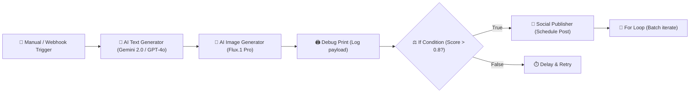
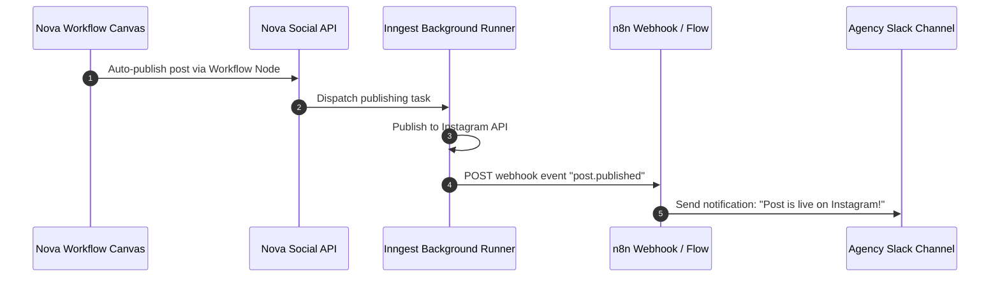

# Nova AI Use Cases

Nova AI bridges generative AI media creation with visual node-based workflow automation and multi-channel social media publishing. Below are the primary user-facing use cases implemented across the platform.

---

## 1. Interactive Studio Workflows

### 1.1 High-Fidelity Social Media Asset Generation
A digital creator or agency marketer uses Create Studio to generate high-resolution visuals:
1. Chooses between Fal AI models (`Flux.1 Pro`, `Flux Realism`, or `Stable Diffusion XL`).
2. Configures aspect ratios (`1:1` Square, `16:9` Landscape, `9:16` Story/Reel, `4:5` Portrait).
3. The platform validates token balances, generates the asset via Fal AI, stores the master asset and watermarked derivatives in Cloudflare R2, records asset metadata in PostgreSQL, and caches the result in Redis.

### 1.2 Asset Refinement & Derivative Processing
1. A creator selects an existing generated image from their personal library.
2. They trigger **8K Upscaling** or **Background Removal** to create a transparent product photo.
3. The derivative is stored as a distinct asset referencing the original parent, allowing non-destructive versioning.

### 1.3 Token Credits & Gated Downloads
1. Free-tier creators receive 50 daily tokens automatically replenished every midnight UTC by an Inngest cron function.
2. Browsing and watermarked downloads are free.
3. High-resolution, watermark-free downloads cost 1 token per export, verified and deducted via atomic transactions.

---

## 2. Visual Workflow Automation Engine

Nova AI provides a visual canvas powered by React Flow with 13 modular node types, compact card interfaces ($240 \times 64\text{ px}$), sliding drawer parameter configuration, and a client-side topological execution runner.

### 2.1 Automated Content Creator Pipeline
**Scenario**: An influencer needs 5 distinct daily Instagram posts generated from trending concepts.
1. **Manual Trigger / Webhook**: Kicks off the workflow with topic keywords.
2. **AI Text Generator Node**: Queries OpenRouter (such as NVIDIA Nemotron 3.5 Lightning, InclusionAI Ling 3.0 Flash, or Meta Llama 3.3) to expand the concept into an evocative image prompt and accompanying Instagram caption with hashtags.
3. **AI Image Generator Node**: Consumes the generated prompt from the text generator, dispatches a generation request to Fal AI `Flux.1 Pro`, and saves the visual to Cloudflare R2.
4. **Debug Print Node**: Inspects the generated image URL and prompt in the real-time execution drawer console.
5. **Social Publishing Node**: Automatically formats the caption, attaches the generated R2 image URL, and dispatches a scheduled post to the connected Instagram account.

### 2.2 Quality Control with Conditional Branching
**Scenario**: Filter out low-confidence prompt expansions before triggering costly GPU image synthesis.
1. **AI Text Generator Node**: Evaluates prompt suitability and returns a confidence score.
2. **If-Condition Node**: Compares `confidence >= 0.85`.
   - **`TRUE_OUT`**: Proceeds directly to Fal AI Image Generator.
   - **`FALSE_OUT`**: Routes to a Fallback Set-Fields Node that applies a curated default prompt.

### 2.3 Batch Asset Generation with For-Loops
**Scenario**: Generate e-commerce banner variations for an array of products.
1. **Set-Fields Node**: Injects an array of product titles (`["Wireless Earbuds", "Smart Watch", "Noise-Cancelling Headphones"]`).
2. **For-Loop Node**: Slices the array in batches of 1 item per loop iteration.
3. **AI Image Generator Node**: Generates an aesthetic product backdrop for each item.
4. **JavaScript Code Node**: Aggregates output image URLs into a consolidated summary payload.

---

## 3. Social Publishing & n8n Scheduling

Nova AI provides automated scheduling to external social networks and bidirectional integration with external automation tools like n8n.

### 3.1 Multi-Channel Scheduled Publishing
1. A creator selects one or more generated images and opens the **Schedule Post** interface.
2. They select target accounts (e.g., Instagram `@novacreator` and X `@novacreator_ai`).
3. They set a release date and time in their local timezone.
4. The system validates caption lengths, aspect ratio constraints, and persists a `scheduled` post record.
5. An Inngest function `publishScheduledPost` sleeps until the designated UTC timestamp, connects to the social network API, uploads the media, and publishes the update.

### 3.2 Bidirectional n8n Webhook Automation

1. **Nova to n8n**: When a post successfully publishes or encounters a platform error, Nova AI fires an HMAC-SHA256 signed webhook to n8n.
2. **n8n to Nova**: An n8n cron workflow queries external trends (e.g. RSS feeds or Google Trends), formulates a topic payload, and invokes `POST /api/social/posts/publish` on Nova AI to trigger instant autonomous generation and posting.
