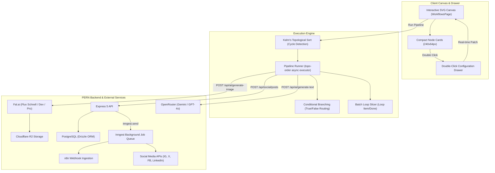

# Workflow Automation Engine

Nova AI provides a visual, node-based automation engine inspired by n8n. Creators can chain triggers, AI generators, logical control branches, data transforms, and multi-channel social publishers on an interactive canvas.

---

## Architecture Overview



---

## Complete Node Catalog

Nodes are categorized into **Source**, **Trigger**, **Control**, **Transform**, and **Destination**. All nodes use a compact $240 \times 64\text{ px}$ card form factor.

| Node Name | Type ID | Category | Ports (Input &rarr; Output) | Description |
| :--- | :--- | :--- | :--- | :--- |
| **Image Library** | `image-asset` | Source | None &rarr; `IMAGE_OUT` | Selects existing assets from the creator's history or collection to emit downstream. |
| **AI Image Generator** | `ai-image-generator` | Source | `PROMPT_IN` &rarr; `IMAGE_OUT` | Synthesizes artwork with Fal AI (20 models including Flux 1.1 Pro Ultra, Flux Dev/Pro/Schnell, SD 3.5 Large/Medium, Ideogram v2, Recraft v3, Nano Banana Pro) and saves to Cloudflare R2. |
| **AI Text Generator** | `ai-text-generator` | Source | `PROMPT_IN` &rarr; `TEXT_OUT` | Generates copy, captions, and hashtags using OpenRouter LLMs (17 models including Gemini 2.0 Flash, Gemini 1.5 Pro, GPT-4o, GPT-4o Mini, Nemotron 3.5, Gemma 4). |
| **HTTP Request** | `http-request` | Trigger | None &rarr; `RESPONSE_OUT` | Executes external HTTP calls (`GET`, `POST`, `PUT`, `PATCH`, `DELETE`) with custom headers and body. |
| **Webhook / Transform** | `webhook` | Trigger | `PAYLOAD_IN` &rarr; `PAYLOAD_OUT` | Receives inbound webhook events or transforms inbound JSON payloads. |
| **If (Condition)** | `if-condition` | Control | `VALUE_IN` &rarr; `TRUE_OUT`, `FALSE_OUT` | Evaluates conditions (`equals`, `contains`, `greater_than`, `is_empty`) and routes to distinct output branches. |
| **For (Loop)** | `for-loop` | Control | `ARRAY_IN` &rarr; `LOOP_ITEM`, `DONE_OUT` | Slices array payloads into batches (`batchSize`) and signals completion via `Done`. |
| **Delay / Wait** | `delay-wait` | Control | `FLOW_IN` &rarr; `FLOW_OUT` | Pauses execution for a configured duration (seconds or minutes). |
| **Code (JavaScript)** | `code-javascript` | Transform | `DATA_IN` &rarr; `PAYLOAD_OUT` | Executes sandboxed JavaScript functions `new Function("data", ...)` to transform payloads. |
| **Set (Edit Fields)** | `set-fields` | Transform | `PAYLOAD_IN` &rarr; `PAYLOAD_OUT` | Appends or replaces key-value pairs (`string`, `number`, `boolean`) in the workflow payload. |
| **Print / Debug** | `debug-print` | Transform | `PAYLOAD_IN` &rarr; `PAYLOAD_OUT` | Logs formatted payloads (JSON/Text) to the execution console and forwards data unchanged. |
| **Multi-Channel** | `socials-aggregator` | Destination | `MEDIA_IN` &rarr; `PUBLISHED` | Fan-out publisher dispatching to Instagram, Facebook, and X simultaneously. |
| **Instagram / X / FB / LinkedIn / YouTube / TikTok** | `social-*` | Destination | `MEDIA_IN` &rarr; `PUBLISHED` | Single-platform publishers with custom captioning and scheduling. |

---

## Wire Connections & Port Geometry

Cards have a height of $64\text{ px}$. To ensure visual alignment:
* **Single-Port Nodes**: Left input and right output handles are centered at $y = 32\text{ px}$.
* **Dual-Output Control Nodes** (`If`, `For`):
  * Primary Branch (`TRUE_OUT`, `LOOP_ITEM`): Placed at $y = 20\text{ px}$ with green/blue accents.
  * Secondary Branch (`FALSE_OUT`, `DONE_OUT`): Placed at $y = 44\text{ px}$ with red/purple accents.

### Port Compatibility Matrix

```text
Source Port Type ──► Permitted Target Port Types
-------------------------------------------------
image            ──► image, any
text             ──► text, any, image (prompt coercion)
http-response    ──► any, json, text
webhook-payload  ──► any, json, text
json             ──► json, any, text
any              ──► any, image, text, json, http-response
```

---

## Execution Pipeline Lifecycle

```mermaid
sequenceDiagram
    autonumber
    actor Creator
    participant Canvas as WorkflowsPage (UI)
    participant Engine as ExecutionEngine
    participant API as Express API
    participant AI as Fal AI / OpenRouter
    participant Storage as Cloudflare R2
    participant Inngest as Inngest Queue

    Creator->>Canvas: Clicks "Run Pipeline"
    Canvas->>Engine: runPipeline(nodes, edges, callbacks)
    Note over Engine: Kahn's algorithm performs topological sort
    
    loop For each sorted node
        Engine->>Engine: Evaluate incoming edge payloads
        alt Node is AI Image Generator
            Engine->>API: onGenerateImage(prompt, model, aspectRatio)
            API->>AI: Fal AI generate
            AI-->>API: Image URL
            API->>Storage: Store original & watermarked copies in R2
            Storage-->>API: Presigned R2 URLs
            API-->>Engine: Return asset metadata
        else Node is If Condition
            Engine->>Engine: Evaluate condition (e.g. data.status == "success")
            Note over Engine: Activates TRUE_OUT; marks FALSE_OUT branch as idle
        else Node is Social Publisher
            Engine->>API: onPublishPost(mediaUrl, caption, platforms)
            API->>Inngest: inngest.send("social/post.scheduled")
            API-->>Engine: 200 OK (Post record created)
        else Node is Print / Debug
            Engine->>Canvas: onLog("[Debug Output]: ...", level)
        end
        Engine->>Canvas: onNodeStatus(nodeId, "success")
    end
    Engine->>Canvas: onComplete()
```

---

## Double-Click Configuration Drawer

Double-clicking any card on the canvas (or clicking its configure button) opens the slide-over drawer:
1. **Parameters & Settings Tab**:
   * Context-specific configuration controls with real-time bidirectional synchronization to the canvas state.
   * Direct execution action buttons (e.g., **"Generate Artwork Now"**, **"Generate Text Now"**) for immediate testing.
2. **Test & Execution Tab**:
   * Isolated node test harness (**"Execute Node"**).
   * Live latency measurement, HTTP status codes, and a syntax-highlighted JSON viewer with a one-click copy button.
